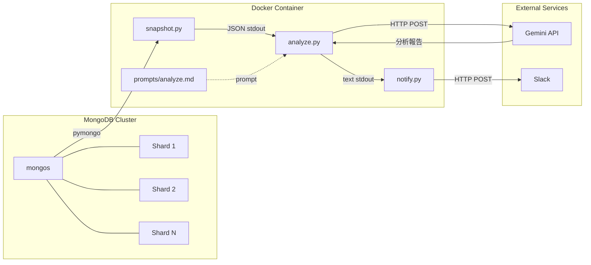
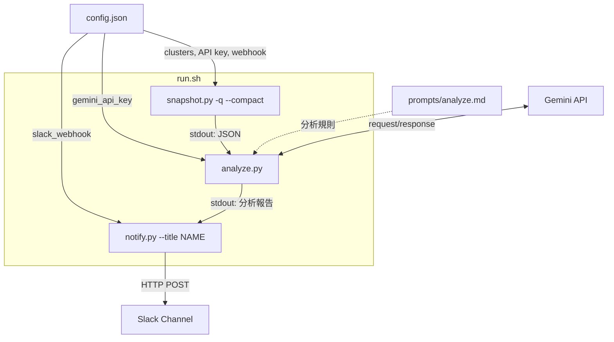
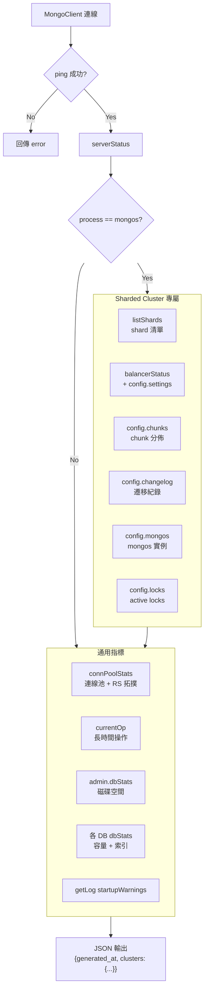
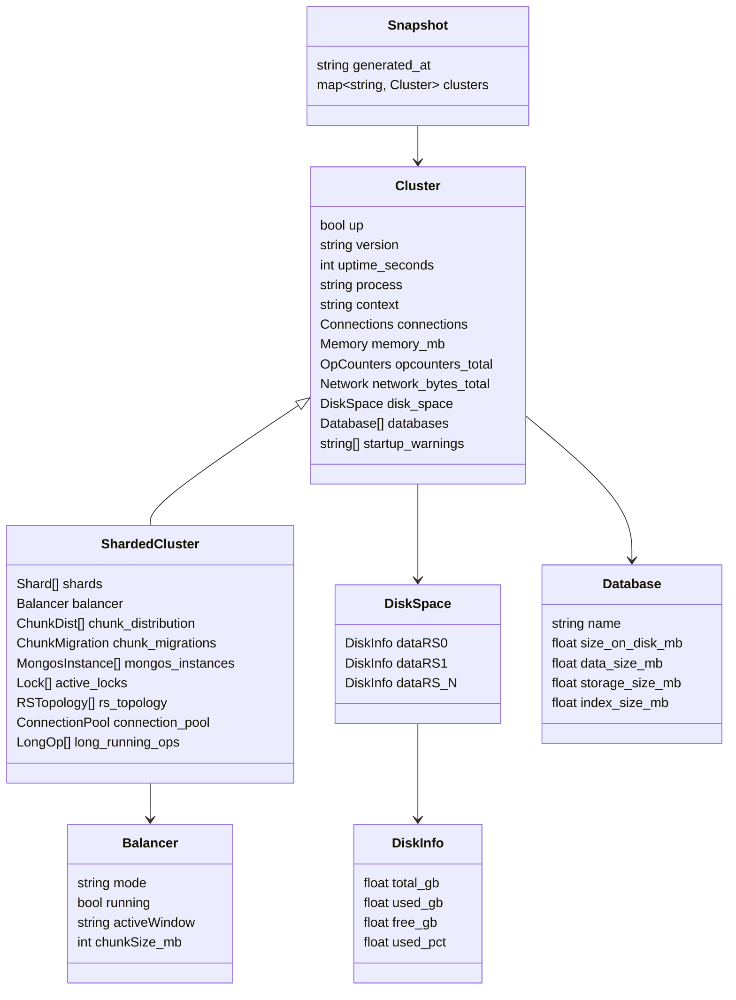
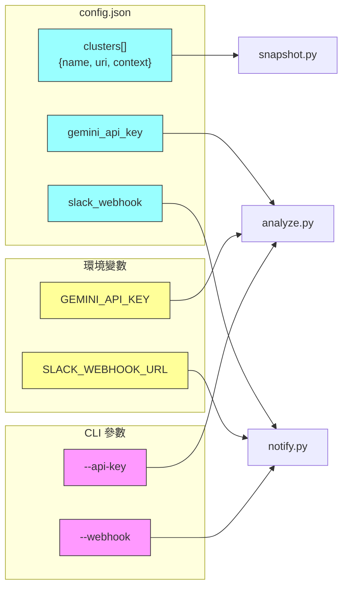
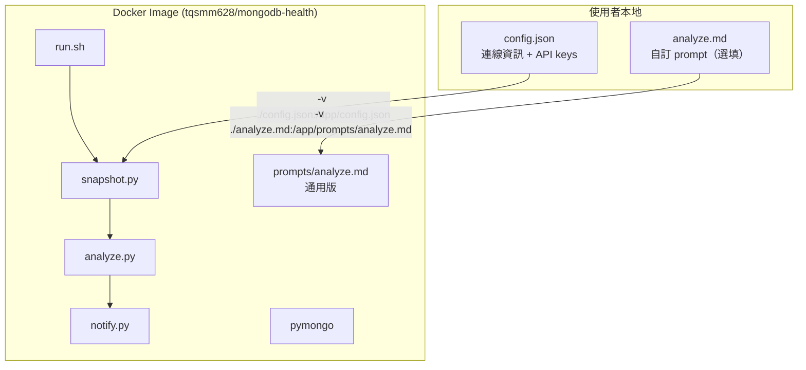
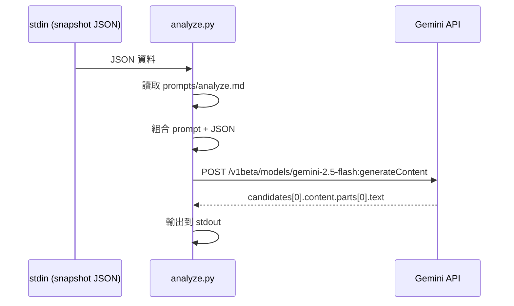
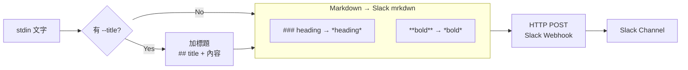
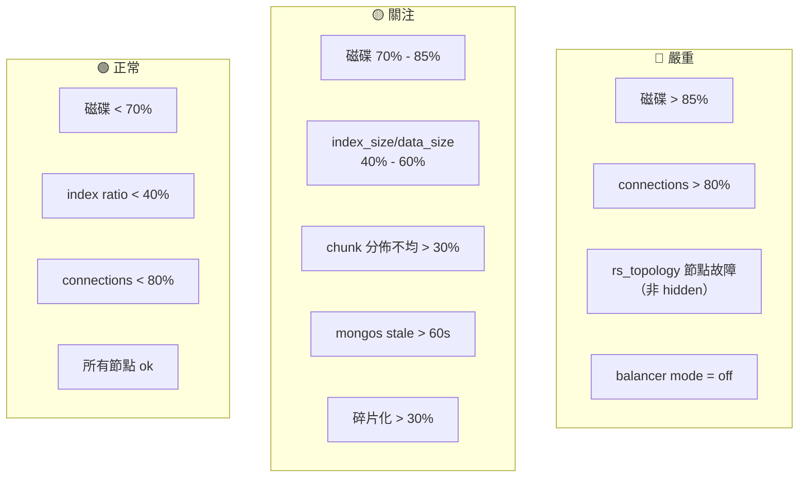

# Architecture

## 系統概覽

## Pipeline 資料流

三個 Python 腳本透過 Unix pipe 串接，每個元件獨立可用。

## snapshot.py 資料收集

透過 mongos 連線，收集 12 類健康指標。

## Snapshot JSON 結構

## 設定解析

config.json 的值如何流入各元件。

每個元件的設定來源優先順序：**CLI 參數 > 環境變數 > config.json**

## Docker 部署

## AI 分析流程

analyze.py 如何與 Gemini API 互動。

## Slack 通知流程

notify.py 的 Markdown 轉換與發送。

## 監控指標與閾值

